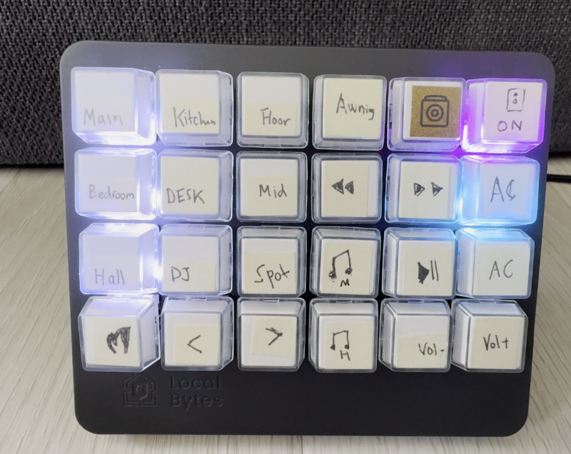
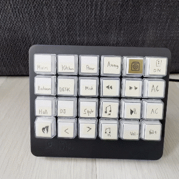
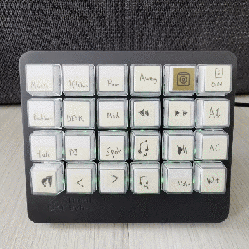
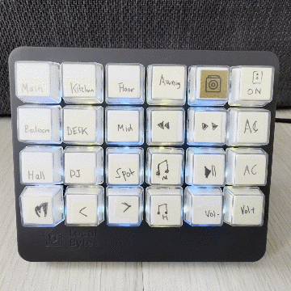

# Local Deck WS

This repository contains alternative firmware for the [LocalDeck](https://www.mylocalbytes.com/products/localdeck) device. This firmware connects directly to Home Assistant via WebSocket API, providing a customizable and responsive interface for controlling your smart home devices.




## Features

- Direct connection to Home Assistant over websocket
- Support for toggling `switch`,`light`,`cover` and `script` entities with a single press
- Support for calling media_player.media_play_pause service for `media_player` entities
- State and brightness tracking for lights
- Brightness control with special up and down buttons (lights only)
    - press this with any light to set the brightness, keep pressed to increase/decrease

- Child Lock Mode (Holding 0,0 + 5,0 for 3 seconds enables child lock mode (Purple LEDs), same actions for disablin (White LEDs)


- Default color and brightness settings for switches
- Visual feedback for connection status

## Setup

### Prerequisites

- PlatformIO installed
- Home Assistant instance running on your network
- LocalDeck hardware

### Configuration

1. Clone this repository
2. Copy `src/secrets.h.example` to `src/secrets.h`
3. Edit `src/secrets.h` with your Wi-Fi and Home Assistant credentials:

```cpp
#define WIFI_SSID "Your_SSID_Here"
#define WIFI_PASSWORD "Your_Password_Here"
#define HA_HOST "Your_HA_IP_Here"
#define HA_PORT 8123
#define HA_API_PASSWORD "Your_Long_Lived_Access_Token_Here"
```

4. Entity Mappings

To configure your entity mappings:

- Copy the `src/config.h.example` file to `src/config.h`.
- Edit `src/config.h` and replace the example mappings with your own Home Assistant entity mappings.
- The Up and Down buttons in the config use the coordinates 2,0 and 1,0 respectively, and may be changed in the config.h file
- Note you will need to make sure in EntityMapping you do not set an entity for the Up and Down buttons if you want to use the brightness control


### Building and Flashing

Use PlatformIO to build and flash the firmware to your LocalDeck device.

## Usage

After flashing the firmware and powering on the LocalDeck, it will attempt to connect to your Wi-Fi network and Home Assistant instance.

### Connection Status Indicators

- Blue moving light: Connecting to Wi-Fi



- Green flashing: Connected to Wi-Fi



- Cyan and Yellow alternating: Connected to Home Assistant WebSocket




- Solid Red: Failed to connect to Wi-Fi


- Red and Orange alternating: Failed to connect to Home Assistant WebSocket

### Controlling Devices

- Short press: Toggle the entity state
- Long press: Currently logs to serial, can be customized for additional functionality

## Troubleshooting

- Make sure `ENABLE_SERIAL_LOGGING` is disabled in [common.h](common.h) if not monitoring via serial! It somehow causes the device to hang when serial buffer is not being consumed!
- If the device shows a connection failure, check your Wi-Fi credentials and Home Assistant configuration in `secrets.h`.
- Ensure your Home Assistant instance is reachable from the network the LocalDeck is connected to.
- Verify that the long-lived access token is valid and has the necessary permissions in Home Assistant.
- You will need sensor.time to be enabled in Home Assistant and set to the correct timezone for nightmode to work correctly

## Contributing

Contributions are welcome! Please feel free to submit a Pull Request.

