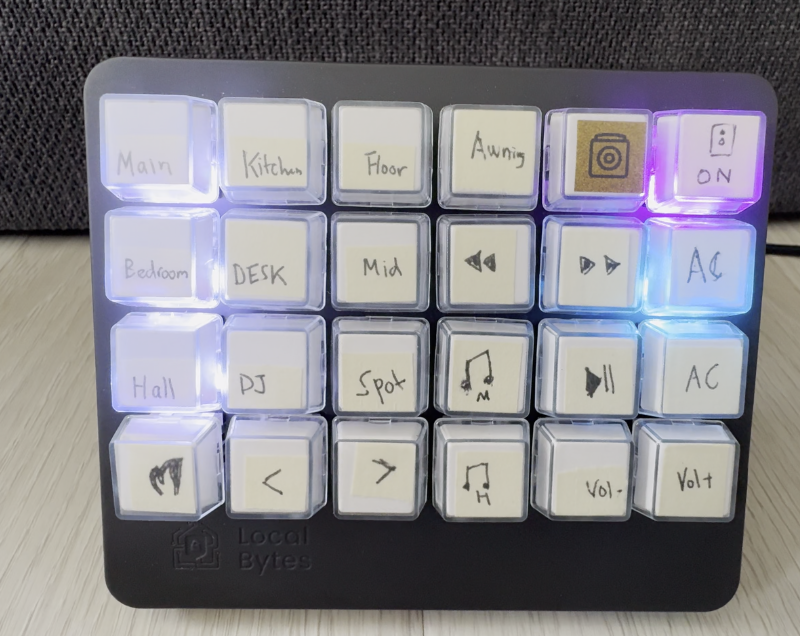
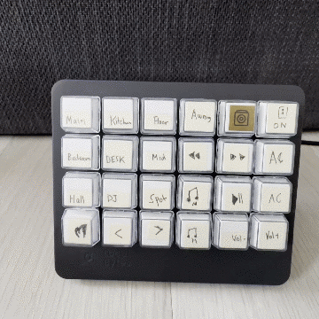
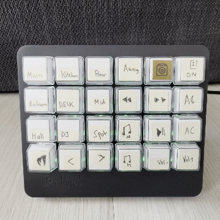
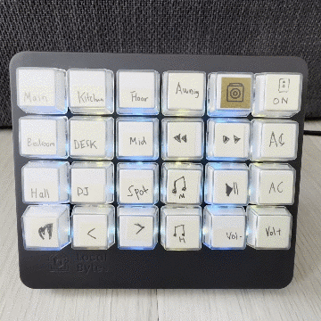

# Local Deck WS

This repository contains alternative firmware for the [LocalDeck](https://www.mylocalbytes.com/products/localdeck) device. This firmware connects directly to Home Assistant via WebSocket API, providing a customizable and responsive interface for controlling your smart home devices.




## Features

- Direct connection to Home Assistant over websocket
- Web UI on the deck itself for remapping buttons live: pick from your Home Assistant entities, drag them onto
  buttons, change colours, no reflash needed (see [Web UI](#web-ui))
- Support for toggling `switch`,`light`,`cover` and `script` entities with a single press
- Support for calling media_player.media_play_pause service for `media_player` entities
- Support for toggling `input_boolean`, `fan` and `automation` entities, activating `scene`s, and pressing `button`/`input_button` entities
- State and brightness tracking for lights
- Brightness/Volume/Position/Speed control with special up and down buttons (lights / media_player / covers / fans)
    - press this with any light/media player/cover/fan to set the brightness/volume/position/speed, keep pressed to increase/decrease
    - covers are only offered this if Home Assistant reports they support `set_cover_position`; one that
      only opens, closes and stops (many awnings) keeps plain toggle behaviour
    - fans likewise, if Home Assistant reports they support `set_percentage` (a fan that is only on or off keeps plain
      toggle behaviour). The key's LED shows the fan's speed; Home Assistant rounds to the fan's own speed steps

- Child Lock Mode (Holding 0,0 + 5,0 for 1 seconds enables child lock mode (Purple LEDs), same actions for disabling (White LEDs)
    - Both buttons + time for child lock mode can be configured in config.h


- Default color and brightness settings for switches
- Visual feedback for connection status

## Setup

### Prerequisites

- PlatformIO installed
- Home Assistant instance running on your network
- LocalDeck hardware

### Configuration

1. Clone this repository
2. Copy `src/secrets.h.example` to `src/secrets.h`
3. Edit `src/secrets.h` with your Wi-Fi and Home Assistant credentials:

```cpp
#define WIFI_SSID "Your_SSID_Here"
#define WIFI_PASSWORD "Your_Password_Here"
#define HA_HOST "Your_HA_IP_Here"
#define HA_PORT 8123
#define HA_API_PASSWORD "Your_Long_Lived_Access_Token_Here"
```

4. Entity Mappings

To configure your entity mappings:

- Copy the `src/config.h.example` file to `src/config.h`.
- Edit `src/config.h` and replace the example mappings with your own Home Assistant entity mappings.
- The Up and Down buttons in the config use the coordinates 2,0 and 1,0 respectively, and may be changed in the config.h file
- Note you will need to make sure in EntityMapping you do not set an entity for the Up and Down buttons if you want to use the brightness control

5. Enable sensors.time in Home Assistant

Entity mappings in `config.h` are only the starting layout: once the deck is running you can change them from the
[Web UI](#web-ui) instead.

### Building and Flashing

Use PlatformIO to build and flash the firmware to your LocalDeck device.

## Usage

After flashing the firmware and powering on the LocalDeck, it will attempt to connect to your Wi-Fi network and Home Assistant instance.

### Connection Status Indicators

- Blue moving light: Connecting to Wi-Fi



- Green flashing: Connected to Wi-Fi



- Cyan and Yellow alternating: Connected to Home Assistant WebSocket




- Solid Red: Failed to connect to Wi-Fi


- Red and Orange alternating: Failed to connect to Home Assistant WebSocket

### Web UI

Once the deck is on Wi-Fi, open **http://localdeck.local/** (or the deck's IP address, printed on the serial log and
shown in your router) in a browser on the same network.

- The grid on the left is the deck, laid out as it sits in front of you. Keys light up with what the deck is showing.
- The list on the right is every Home Assistant entity a button can drive, fetched live from Home Assistant. Search
  it, or filter by domain.
- **Drag an entity onto a key** to assign it. Drag keys onto each other to swap them, or back onto the list to clear
  one. On a phone, tap a key and then tap an entity.
- Tap a key to change its colour and brightness (used for switches, scripts, media players, and lights until they
  report their own colour), to type an entity id by hand, or to **Press** it and check it does what you expect.
- Every change is live immediately and saved on the deck, so it survives reboots and reflashes.
- **Export as config.h** gives you the layout as an `entityMappings` block to paste into `config.h`.
  **Reset to config.h** throws away the saved layout and goes back to what `config.h` says.

The ▲/▼ keys are reserved for the brightness / volume gesture and can't be assigned.

The web UI has no password by default, so anyone on your network can remap the buttons. To require one, add to
`secrets.h`:

```cpp
#define WEB_UI_PASSWORD "Pick_A_Password"   // user name is "admin", or set WEB_UI_USERNAME
```

To change the network name, build with `-DDEVICE_HOSTNAME=\"otherdeck\"`. To leave the web UI out entirely, add
`#define ENABLE_WEB_UI false` to `config.h`.

The entity list is read from Home Assistant's REST API (`/api/states`) using the token in `secrets.h`; the token itself
never reaches the browser.

### Controlling Devices

- Short press: Toggle the entity state
- Long press: Currently logs to serial, can be customized for additional functionality

## Troubleshooting

- Spotify may not work great for volume control, I think home assistant seems to get rate limited or something so its not as reliable as it should be. Controlling the volume of your media player directly is better if possible. 
- Make sure `ENABLE_SERIAL_LOGGING` is disabled in [common.h](common.h) if not monitoring via serial! It somehow causes the device to hang when serial buffer is not being consumed!
- If the device shows a connection failure, check your Wi-Fi credentials and Home Assistant configuration in `secrets.h`.
- Ensure your Home Assistant instance is reachable from the network the LocalDeck is connected to.
- Verify that the long-lived access token is valid and has the necessary permissions in Home Assistant.
- You will need sensor.time to be enabled in Home Assistant and set to the correct timezone for nightmode to work correctly

## Contributing

Contributions are welcome! Please feel free to submit a Pull Request.

